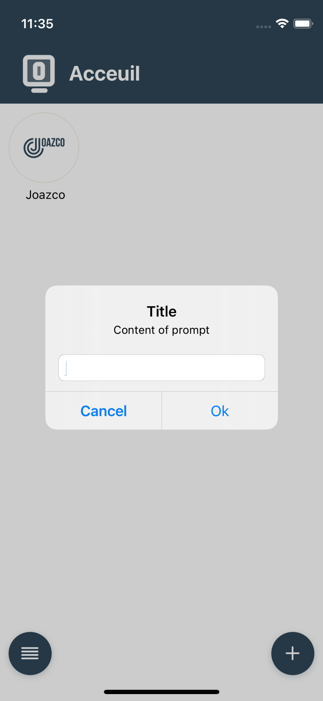
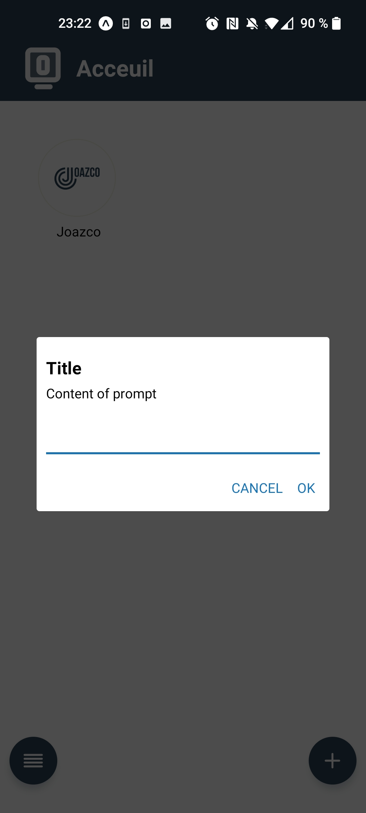

# react-native-prompt-cross

A cross-platform prompt component for React Native.

## Installation

```
$ npm install react-native-prompt --save
```

## Demo

| iOS                 | Android                 |
| ------------------- | ----------------------- |
|  |  |

## Basic Usage

```js
import Prompt from "react-native-prompt-cross";

<Prompt
  title="Title"
  message="Content of prompt"
  defaultValue="value"
  visible={visibleState}
  useNatifIosPrompt
  callbackOrButtons={[
    {
        text: "Cancel",
        style: "cancel",
        onPress: () => setVisibleState(false),
    },
    {
        text: "Ok",
        onPress: (text?: string) => {
            setVisibleState(false);
        },
    },

/>;
```

## API

[You can see to](https://reactnative.dev/docs/alert#prompt-ios)

Props:

- `visible` (boolean, required) -- When `true`, the prompt is displayed, closes otherwise
- `title` (string, required) -- The dialog's title.
- `message` (string) -- An optional message that appears above the text input.
- `callbackOrButtons` (((text?: string) => void) | AlertButton[]) -- If passed a function, it will be called with the prompt's value. If you use array of AlertButton, react-native-prompt-cross can show maximum two buttons
  (text: string) => void, when the user taps 'OK'.
  If passed an array, buttons will be configured based on the array content.
- `type` (AlertType) -- This configures the text input.
- `defaultValue` (string) -- The default text in text input.
- `keyboardType` (string) -- The keyboard type of first text field (if exists). One of TextInput keyboardTypes.
- `useNatifIosPrompt` (boolean, default `true`) -- Set at false if you want use react component not native
